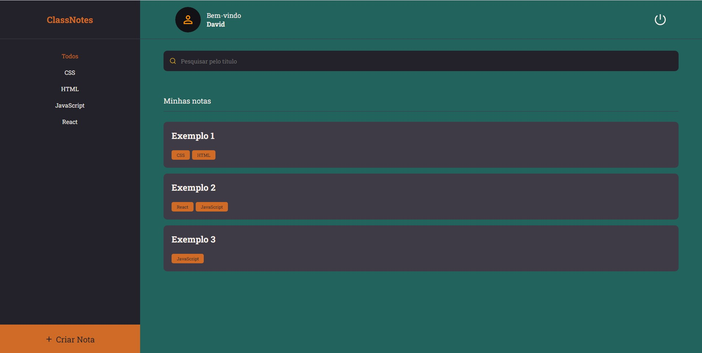

<h1 align="center"> :spiral_notepad: ClassNotes </h1>

<h1 align="center">
   
   
</h1>

## :computer: Projeto
O aplicativo ClassNotes tem como objetivo auxiliar na melhor organização de anotações de aulas, podendo guardar consigo anotações, links e organiza-las por tags.
Este projeto foi desenvolvido durante o curso Explorer da RocketSeat e para entrega do trabalho final do curso WebDev Full Stack Resilia.

Você pode testar a aplicação [clicando aqui!](https://classnotesapp.netlify.app/)

## :hammer: Funcionalidades
- Criar conta
- Logar na aplicação
- Cadastro de anotações, links e tags.
- Pesquisar e filtrar por títulos e tags das anotações.
- Editar o perfil do usuário; foto, nome, email e senha.

## :rocket: Tecnologias
- [React](https://reactjs.org)
- [JavaScript](https://www.javascript.com/)
- [GitHub](https://github.com/)
- [Vite](https://vitejs.dev/)
- [Styled Components](https://styled-components.com/)
- [React Router Dom](https://v5.reactrouter.com/web/guides/quick-start)
- [react-icons](https://react-icons.github.io/react-icons/)
- [Axios](https://axios-http.com/ptbr/docs/intro)
- [Netlify](https://www.netlify.com/)

## :bulb: Utilização

- Para utilizar esse projeto localmente, primeiro você precisará instalar o backend deste [repositório](https://github.com/Ddsans/API-ClassNotes.git).

- Comece clonando o projeto:

```bash
  $git clone https://github.com/Ddsans/API-ClassNotes-FrontEnd.git
```

- Entre no diretório:

```bash
  $cd API-ClassNotes-FrontEnd
/
```

- Instale as dependências:

```bash
  $npm install
```

- Defina a variável local, no arquivo src/services/api.js , conforme o endereço que será gerado no backend. Exemplo:

```JS
  baseURL:http://localhost:3500

```

- Inicie um servidor local para o frontend:

```bash
  $npm run dev
```


- Agora abra seu navegador no endereço que foi informado no "`Local`" para testar a aplicação.

## :people_holding_hands: Equipe
- <a href="https://github.com/Ddsans">@Ddsans</a>
- <a href="https://github.com/MatokoLB">@MatokoLB</a>
- <a href="https://github.com/Julia-Pauline">@Julia-Pauline</a>
- <a href="https://github.com/pires01">@pires01</a>
